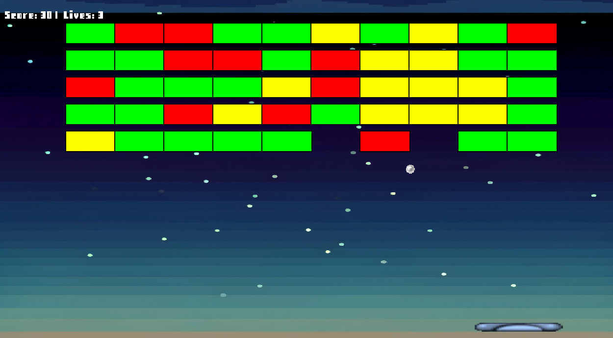

# MyArkanoid - Классический Арканоид на SFML

 <!-- Добавьте скриншот позже -->

Простая, но увлекательная реализация классической игры Arkanoid с использованием библиотеки SFML.

## 🚀 Особенности

- Реализация физики отскока мяча
- Три типа разрушаемых блоков с разной прочностью(в будущем больше)
- Система подсчёта очков и жизней
- Звуковые эффекты для различных событий

## 📦 Установка

### Требования
- CMake 3.15+
- SFML 2.6.x
- Компилятор с поддержкой C++17

### Сборка
```bash
git clone https://github.com/habibka6/MyArkanoid.git
cd MyArkanoid
mkdir build && cd build
cmake ..
cmake --build .
Запуск
bash
./MyArkanoid  # Linux/MacOS
MyArkanoid.exe  # Windows

🎮 Управление
← → - движение платформы
ESC - выход из игры

🏗️ Структура проекта
MyArkanoid/
├── assets/           # Ресурсы игры
│   ├── textures/     # Текстуры
│   ├── fonts/        # Шрифты
│   ├── sounds/       # Звуковые эффекты
│   └── images/       # Дополнительные изображения
├── include/          # Заголовочные файлы
├── src/              # Исходный код
├── CMakeLists.txt    # Файл сборки
└── README.md         # Этот файл

📝 Классы
GameEngine - основной игровой цикл и логика
Paddle - управляемая игроком платформа
Ball - мяч с физикой отскока
Block - разрушаемые блоки
AssetManager - менеджер ресурсов
